# WAZAP — Parcours client : de la commande à la livraison

> Référence des **flux bout-en-bout** de WAZAP (Abidjan) : du déclenchement d'une commande
> jusqu'à la livraison, avec l'ensemble des scénarios et chemins alternatifs. Chaque flux est
> illustré par un **diagramme de séquence Mermaid**.
>
> Sources : `Wazap.Domain` (entités/enums), `Wazap.Application` (`OrderService`,
> `DeliveryOfferService`, `ClientPaymentService`, `WhatsAppOrchestrationService`),
> `Wazap.API` (`WebhookWhatsAppController`, `ClientOrdersController`, `OrdersController`,
> `ClaimsController`, bots/services `ClientOrderBotService`, `ColisSurService`,
> `RiderRatingService`, worker `DeliveryOfferWorker`) et le web (`web/src/pages/SuiviPage.tsx`).

## 0. Acteurs, statuts et points d'entrée

| Acteur | Rôle | Canal |
|---|---|---|
| **Client** | commande, confirme l'adresse, suit, remet son code, note | WhatsApp + page de suivi PWA |
| **Vendeur** | crée/confirme la course, paie en crédits | WhatsApp (`LIVRAISON`, `CONFIRMER`), app |
| **Livreur** | accepte, récupère, livre | WhatsApp (`ACCEPTE`, `RECU`, `LIVRE`) |
| **WAZAP** | matching, notifications, paiement, garantie | Web API + workers |

Cycle de vie d'une commande (`OrderStatus`) :



<details><summary>Source Mermaid</summary>

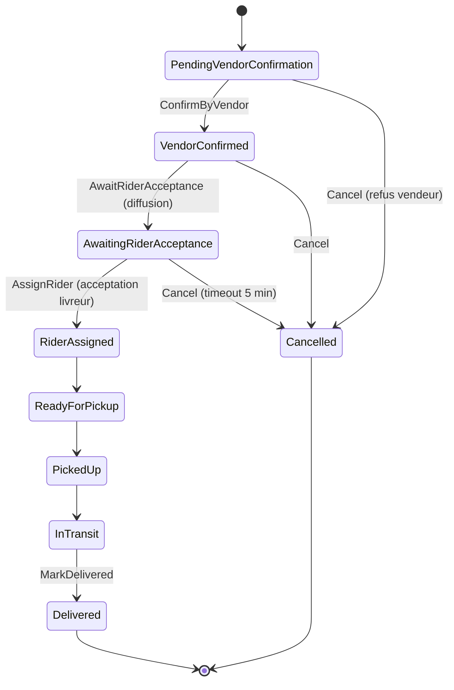
```mermaid
stateDiagram-v2
    [*] --> PendingVendorConfirmation
    PendingVendorConfirmation --> VendorConfirmed : ConfirmByVendor
    PendingVendorConfirmation --> Cancelled : Cancel (refus vendeur)
    VendorConfirmed --> AwaitingRiderAcceptance : AwaitRiderAcceptance (diffusion)
    VendorConfirmed --> Cancelled : Cancel
    AwaitingRiderAcceptance --> RiderAssigned : AssignRider (acceptation livreur)
    AwaitingRiderAcceptance --> Cancelled : Cancel (timeout 5 min)
    RiderAssigned --> ReadyForPickup
    ReadyForPickup --> PickedUp
    PickedUp --> InTransit
    InTransit --> Delivered : MarkDelivered
    Delivered --> [*]
    Cancelled --> [*]
```

</details>

### Sommaire des flux

| # | Flux |
|---|---|
| 1 | Vue d'ensemble (macro) |
| 2 | Flux A — Bot client conversationnel (numéro inconnu) |
| 3 | Flux B — Livraison à la demande (vendeur WhatsApp) |
| 4 | Flux C/D — App vendeur et API publique v1 |
| 5 | Routage après confirmation vendeur |
| 6 | Recherche de livreur (matching, vagues, groupage) |
| 7 | Acceptation du livreur (simple et lot) |
| 8 | Suivi PWA (coordonnées, position live, paiement) |
| 9 | Récupération et livraison (RECU / LIVRE + code) |
| 10 | Paiement Mobile Money (GeniusPay) |
| 11 | Garantie Colis Sûr (sinistre) |
| 12 | Notation du livreur |
| 13 | Recrutement livreur (acquisition) |
| 14 | Options de configuration clés |

## 1. Vue d'ensemble (macro)

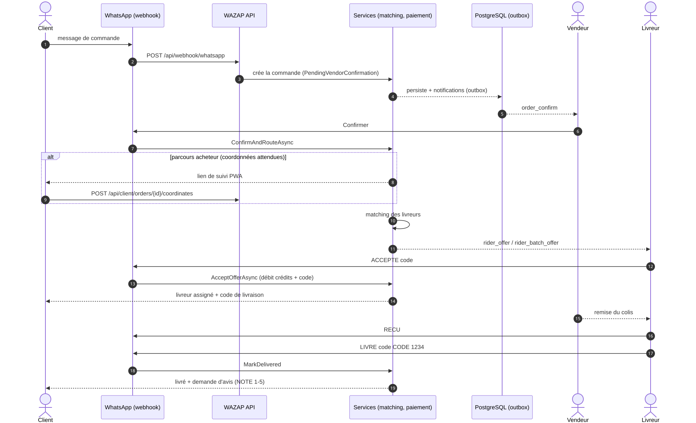

<details><summary>Source Mermaid</summary>

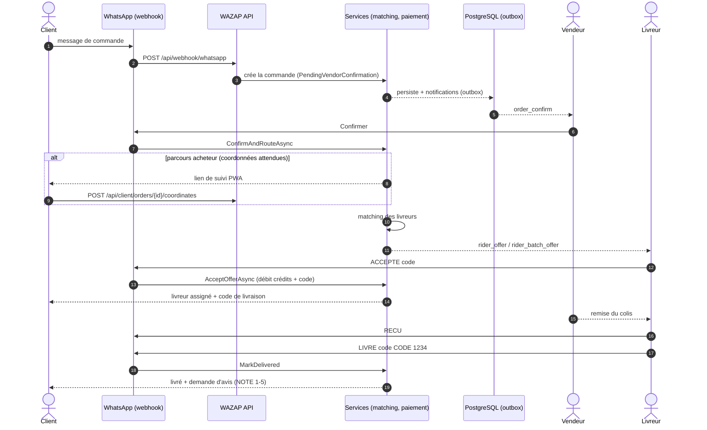
```mermaid
sequenceDiagram
    autonumber
    actor C as Client
    participant W as WhatsApp (webhook)
    participant API as WAZAP API
    participant S as Services (matching, paiement)
    participant DB as PostgreSQL (outbox)
    actor V as Vendeur
    actor L as Livreur

    C->>W: message de commande
    W->>API: POST /api/webhook/whatsapp
    API->>S: crée la commande (PendingVendorConfirmation)
    S-->>DB: persiste + notifications (outbox)
    DB-->>V: order_confirm
    V->>W: Confirmer
    W->>S: ConfirmAndRouteAsync
    alt parcours acheteur (coordonnées attendues)
        S-->>C: lien de suivi PWA
        C->>API: POST /api/client/orders/{id}/coordinates
    end
    S->>S: matching des livreurs
    S-->>L: rider_offer / rider_batch_offer
    L->>W: ACCEPTE code
    W->>S: AcceptOfferAsync (débit crédits + code)
    S-->>C: livreur assigné + code de livraison
    V-->>L: remise du colis
    L->>W: RECU
    L->>W: LIVRE code CODE 1234
    W->>S: MarkDelivered
    S-->>C: livré + demande d'avis (NOTE 1-5)
```

</details>

## 2. Flux A — Bot client conversationnel (numéro inconnu)

Déclenché par un message d'un **numéro inconnu** contenant une intention de commande
(`commande`, `acheter`, `achat`, `panier`) et **aucun** mot-clé de partenariat.

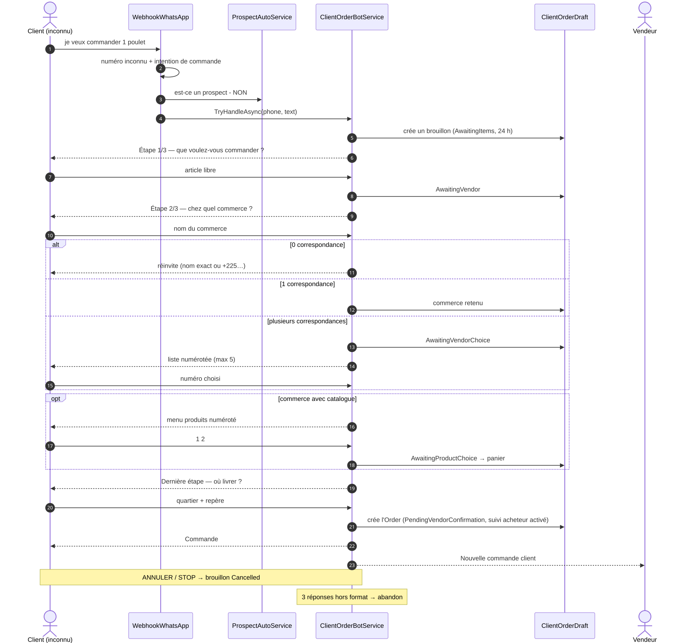

<details><summary>Source Mermaid</summary>

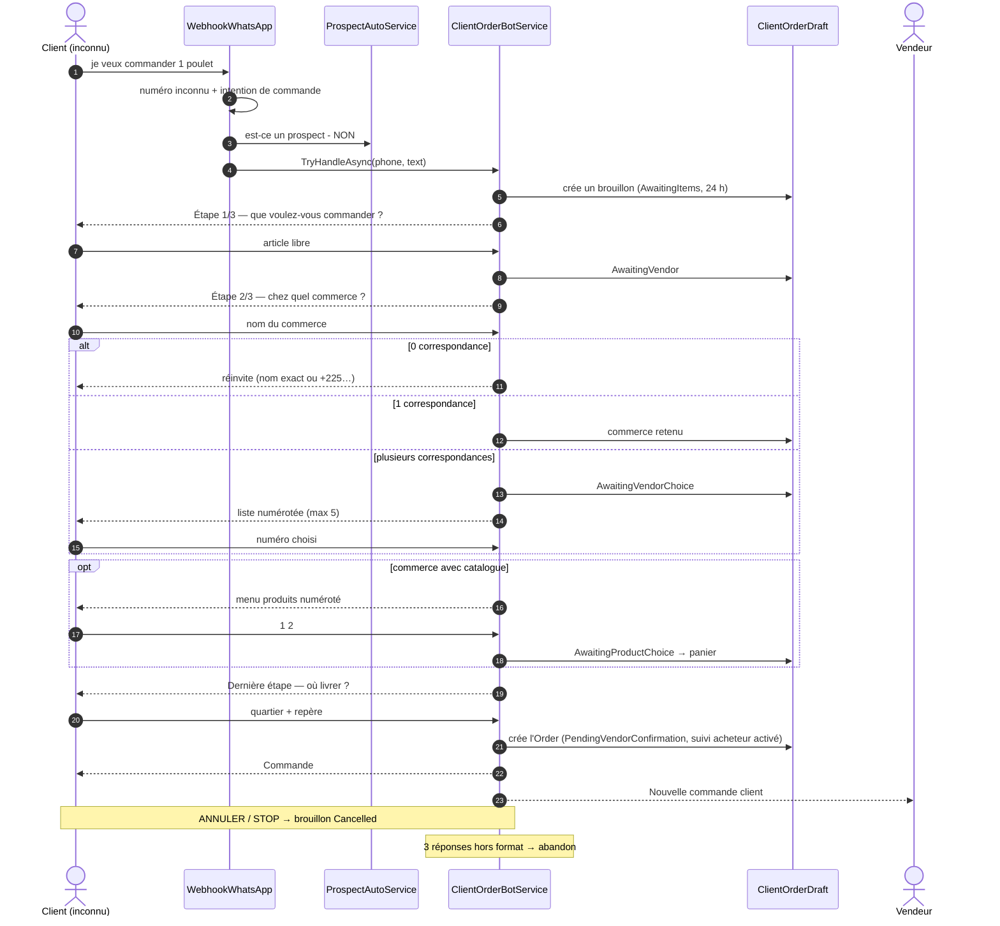
```mermaid
sequenceDiagram
    autonumber
    actor C as Client (inconnu)
    participant W as WebhookWhatsApp
    participant P as ProspectAutoService
    participant B as ClientOrderBotService
    participant DB as ClientOrderDraft
    actor V as Vendeur

    C->>W: je veux commander 1 poulet
    W->>W: numéro inconnu + intention de commande
    W->>P: est-ce un prospect - NON
    W->>B: TryHandleAsync(phone, text)
    B->>DB: crée un brouillon (AwaitingItems, 24 h)
    B-->>C: Étape 1/3 — que voulez-vous commander ?

    C->>B: article libre
    B->>DB: AwaitingVendor
    B-->>C: Étape 2/3 — chez quel commerce ?

    C->>B: nom du commerce
    alt 0 correspondance
        B-->>C: réinvite (nom exact ou +225…)
    else 1 correspondance
        B->>DB: commerce retenu
    else plusieurs correspondances
        B->>DB: AwaitingVendorChoice
        B-->>C: liste numérotée (max 5)
        C->>B: numéro choisi
    end

    opt commerce avec catalogue
        B-->>C: menu produits numéroté
        C->>B: 1 2
        B->>DB: AwaitingProductChoice → panier
    end

    B-->>C: Dernière étape — où livrer ?
    C->>B: quartier + repère
    B->>DB: crée l'Order (PendingVendorConfirmation, suivi acheteur activé)
    B-->>C: Commande #code transmise à Vendeur
    B-->>V: Nouvelle commande client #code

    note over C,B: ANNULER / STOP → brouillon Cancelled
    note over B: 3 réponses hors format → abandon
```

</details>

## 3. Flux B — Livraison à la demande (vendeur WhatsApp)

Commandes texte pour téléphones basiques : la commande est créée **déjà confirmée**, groupée
et diffusée immédiatement. Le crédit n'est **jamais** débité à la création.

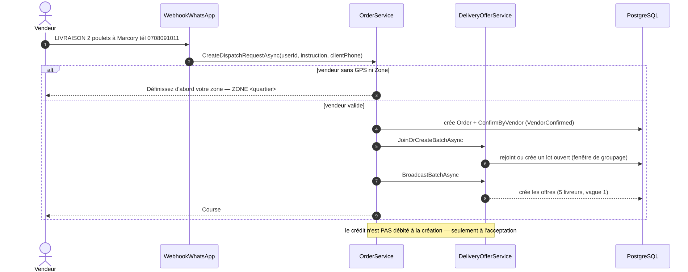

<details><summary>Source Mermaid</summary>

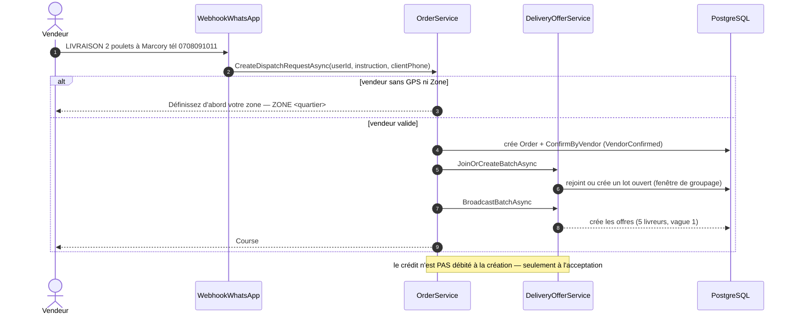
```mermaid
sequenceDiagram
    autonumber
    actor V as Vendeur
    participant W as WebhookWhatsApp
    participant O as OrderService
    participant D as DeliveryOfferService
    participant DB as PostgreSQL

    V->>W: LIVRAISON 2 poulets à Marcory tél 0708091011
    W->>O: CreateDispatchRequestAsync(userId, instruction, clientPhone)
    alt vendeur sans GPS ni Zone
        O-->>V: Définissez d'abord votre zone — ZONE <quartier>
    else vendeur valide
        O->>DB: crée Order + ConfirmByVendor (VendorConfirmed)
        O->>D: JoinOrCreateBatchAsync
        D->>DB: rejoint ou crée un lot ouvert (fenêtre de groupage)
        O->>D: BroadcastBatchAsync
        D-->>DB: crée les offres (5 livreurs, vague 1)
        O-->>V: Course #code enregistrée — Crédits restants : N
    end

    note over O,D: le crédit n'est PAS débité à la création — seulement à l'acceptation
```

</details>

## 4. Flux C/D — App vendeur et API publique v1

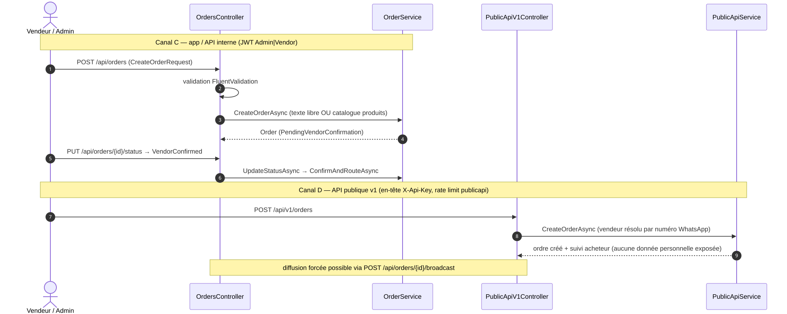

<details><summary>Source Mermaid</summary>

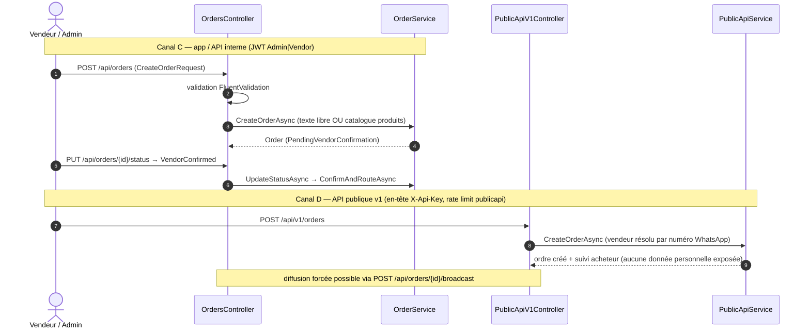
```mermaid
sequenceDiagram
    autonumber
    actor V as Vendeur / Admin
    participant API as OrdersController
    participant O as OrderService
    participant P as PublicApiV1Controller
    participant S as PublicApiService

    Note over V,O: Canal C — app / API interne (JWT Admin|Vendor)
    V->>API: POST /api/orders (CreateOrderRequest)
    API->>API: validation FluentValidation
    API->>O: CreateOrderAsync (texte libre OU catalogue produits)
    O-->>API: Order (PendingVendorConfirmation)
    V->>API: PUT /api/orders/{id}/status → VendorConfirmed
    API->>O: UpdateStatusAsync → ConfirmAndRouteAsync

    Note over V,S: Canal D — API publique v1 (en-tête X-Api-Key, rate limit publicapi)
    V->>P: POST /api/v1/orders
    P->>S: CreateOrderAsync (vendeur résolu par numéro WhatsApp)
    S-->>P: ordre créé + suivi acheteur (aucune donnée personnelle exposée)

    note over API,P: diffusion forcée possible via POST /api/orders/{id}/broadcast
```

</details>

## 5. Routage après confirmation vendeur

Deux sous-parcours : **parcours acheteur** (lien de suivi, diffusion différée) ou **groupage
classique** (diffusion par le worker).

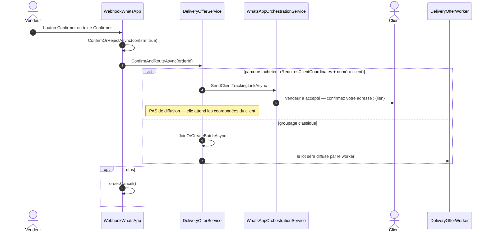

<details><summary>Source Mermaid</summary>

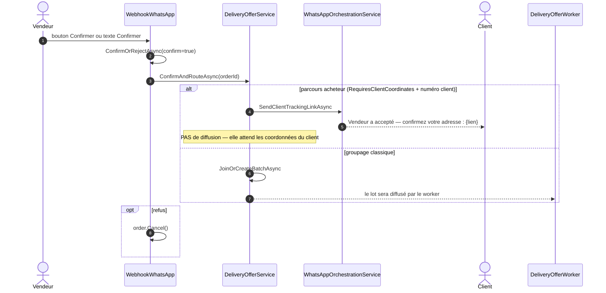
```mermaid
sequenceDiagram
    autonumber
    actor V as Vendeur
    participant W as WebhookWhatsApp
    participant D as DeliveryOfferService
    participant O as WhatsAppOrchestrationService
    actor C as Client
    participant WK as DeliveryOfferWorker

    V->>W: bouton Confirmer ou texte Confirmer
    W->>W: ConfirmOrRejectAsync(confirm=true)
    W->>D: ConfirmAndRouteAsync(orderId)
    alt parcours acheteur (RequiresClientCoordinates + numéro client)
        D->>O: SendClientTrackingLinkAsync
        O-->>C: Vendeur a accepté — confirmez votre adresse : {lien}
        note over D: PAS de diffusion — elle attend les coordonnées du client
    else groupage classique
        D->>D: JoinOrCreateBatchAsync
        D-->>WK: le lot sera diffusé par le worker
    end
    opt refus
        W->>W: order.Cancel()
    end
```

</details>

## 6. Recherche de livreur (matching, vagues, groupage)

Le worker tourne toutes les **5 s**. Il diffuse les lots prêts, gère l'exclusivité (30 s),
l'élargissement et le timeout global (5 min).

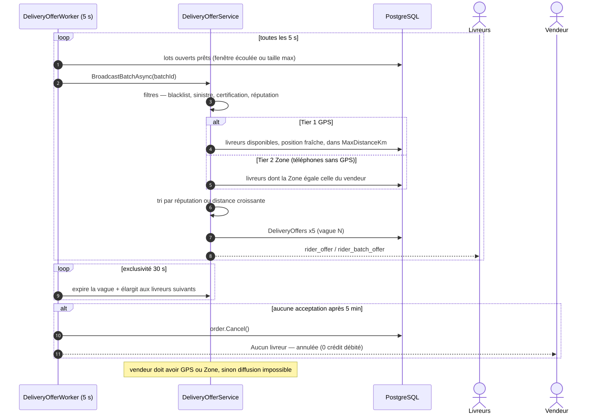

<details><summary>Source Mermaid</summary>

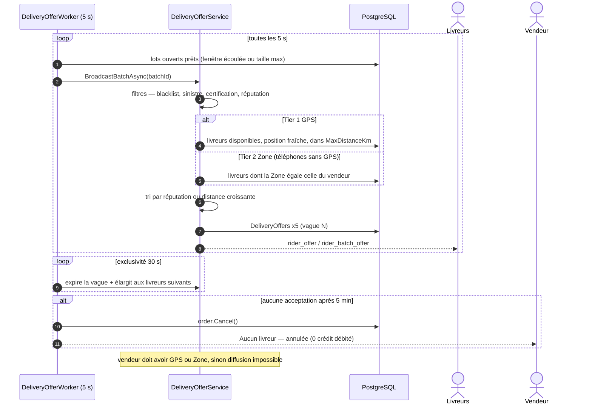
```mermaid
sequenceDiagram
    autonumber
    participant WK as DeliveryOfferWorker (5 s)
    participant D as DeliveryOfferService
    participant DB as PostgreSQL
    actor L as Livreurs
    actor V as Vendeur

    loop toutes les 5 s
        WK->>DB: lots ouverts prêts (fenêtre écoulée ou taille max)
        WK->>D: BroadcastBatchAsync(batchId)
        D->>D: filtres — blacklist, sinistre, certification, réputation
        alt Tier 1 GPS
            D->>DB: livreurs disponibles, position fraîche, dans MaxDistanceKm
        else Tier 2 Zone (téléphones sans GPS)
            D->>DB: livreurs dont la Zone égale celle du vendeur
        end
        D->>D: tri par réputation ou distance croissante
        D->>DB: DeliveryOffers x5 (vague N)
        D-->>L: rider_offer / rider_batch_offer
    end

    loop exclusivité 30 s
        WK->>D: expire la vague + élargit aux livreurs suivants
    end

    alt aucune acceptation après 5 min
        WK->>DB: order.Cancel()
        WK-->>V: Aucun livreur — annulée (0 crédit débité)
    end

    note over D: vendeur doit avoir GPS ou Zone, sinon diffusion impossible
```

</details>

## 7. Acceptation du livreur (simple et lot)

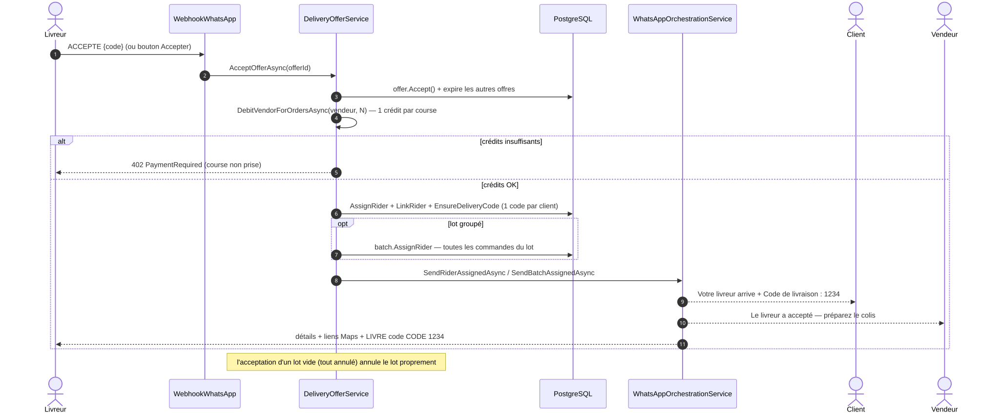

<details><summary>Source Mermaid</summary>

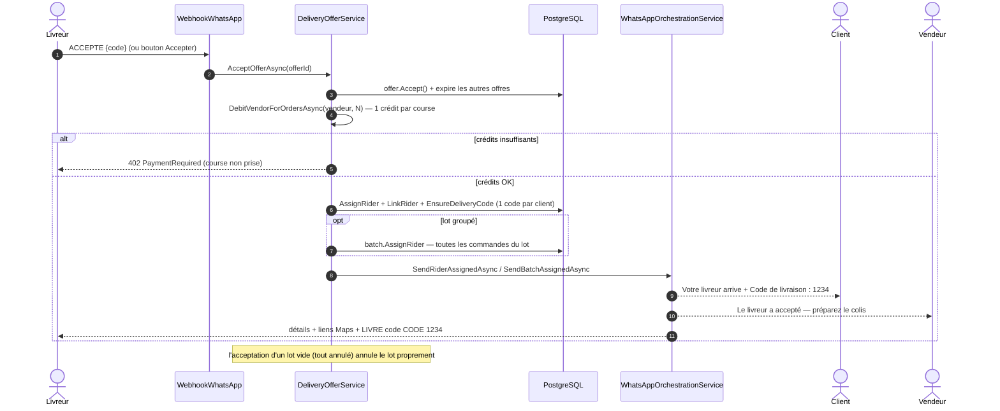
```mermaid
sequenceDiagram
    autonumber
    actor L as Livreur
    participant W as WebhookWhatsApp
    participant D as DeliveryOfferService
    participant DB as PostgreSQL
    participant O as WhatsAppOrchestrationService
    actor C as Client
    actor V as Vendeur

    L->>W: ACCEPTE {code} (ou bouton Accepter)
    W->>D: AcceptOfferAsync(offerId)
    D->>DB: offer.Accept() + expire les autres offres
    D->>D: DebitVendorForOrdersAsync(vendeur, N) — 1 crédit par course
    alt crédits insuffisants
        D-->>L: 402 PaymentRequired (course non prise)
    else crédits OK
        D->>DB: AssignRider + LinkRider + EnsureDeliveryCode (1 code par client)
        opt lot groupé
            D->>DB: batch.AssignRider — toutes les commandes du lot
        end
        D->>O: SendRiderAssignedAsync / SendBatchAssignedAsync
        O-->>C: Votre livreur arrive + Code de livraison : 1234
        O-->>V: Le livreur a accepté — préparez le colis
        O-->>L: détails + liens Maps + LIVRE code CODE 1234
    end

    note over D: l'acceptation d'un lot vide (tout annulé) annule le lot proprement
```

</details>

## 8. Suivi PWA (coordonnées, position live, paiement)

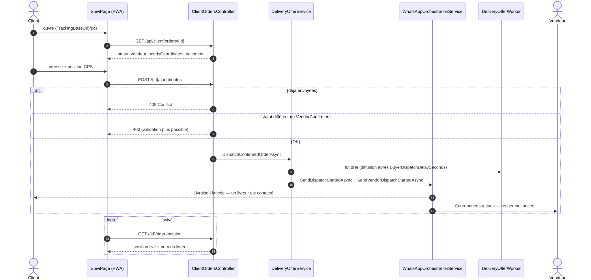

<details><summary>Source Mermaid</summary>

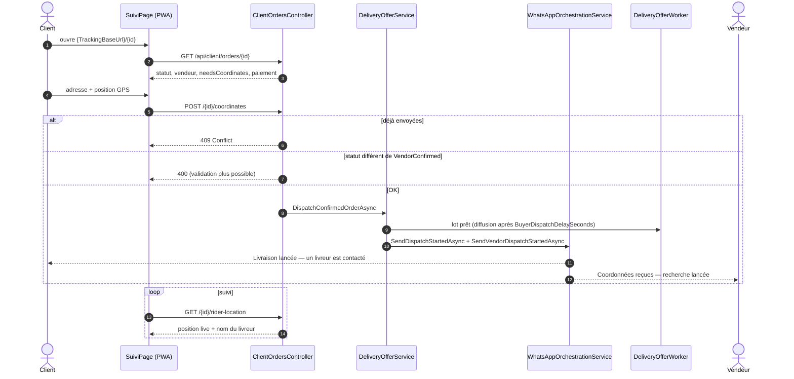
```mermaid
sequenceDiagram
    autonumber
    actor C as Client
    participant P as SuiviPage (PWA)
    participant API as ClientOrdersController
    participant D as DeliveryOfferService
    participant O as WhatsAppOrchestrationService
    participant WK as DeliveryOfferWorker
    actor V as Vendeur

    C->>P: ouvre {TrackingBaseUrl}/{id}
    P->>API: GET /api/client/orders/{id}
    API-->>P: statut, vendeur, needsCoordinates, paiement
    C->>P: adresse + position GPS
    P->>API: POST /{id}/coordinates
    alt déjà envoyées
        API-->>P: 409 Conflict
    else statut différent de VendorConfirmed
        API-->>P: 400 (validation plus possible)
    else OK
        API->>D: DispatchConfirmedOrderAsync
        D->>WK: lot prêt (diffusion après BuyerDispatchDelaySeconds)
        D->>O: SendDispatchStartedAsync + SendVendorDispatchStartedAsync
        O-->>C: Livraison lancée — un livreur est contacté
        O-->>V: Coordonnées reçues — recherche lancée
    end

    loop suivi
        P->>API: GET /{id}/rider-location
        API-->>P: position live + nom du livreur
    end
```

</details>

## 9. Récupération et livraison (RECU / LIVRE + code)

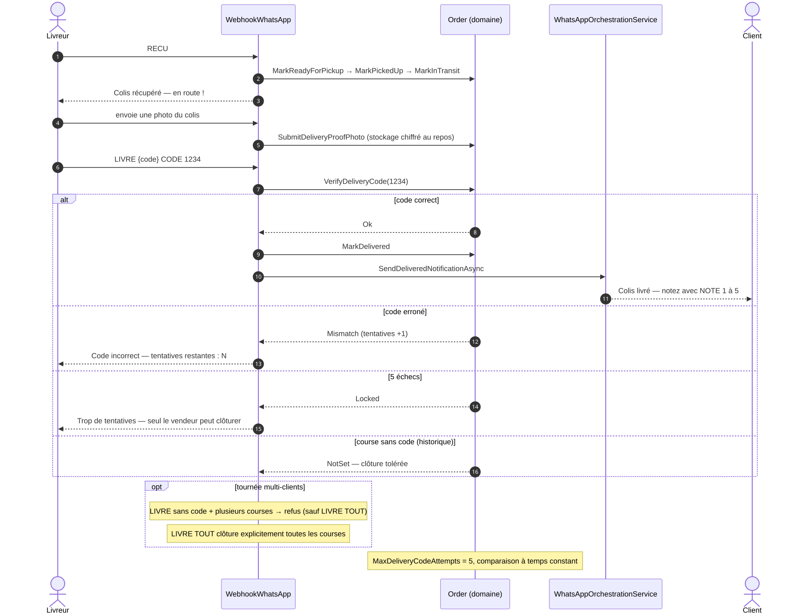

<details><summary>Source Mermaid</summary>

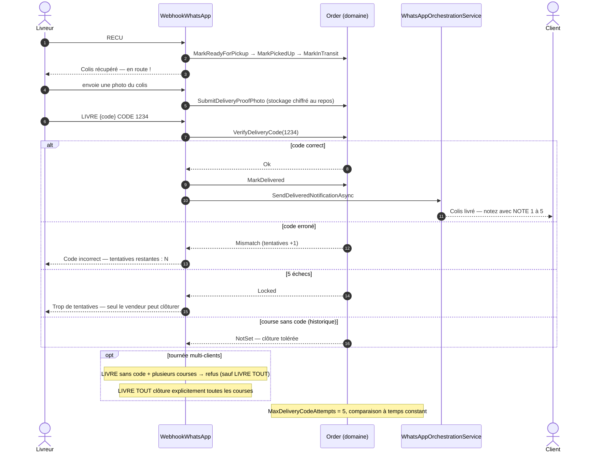
```mermaid
sequenceDiagram
    autonumber
    actor L as Livreur
    participant W as WebhookWhatsApp
    participant O as Order (domaine)
    participant X as WhatsAppOrchestrationService
    actor C as Client

    L->>W: RECU
    W->>O: MarkReadyForPickup → MarkPickedUp → MarkInTransit
    W-->>L: Colis récupéré — en route !

    L->>W: envoie une photo du colis
    W->>O: SubmitDeliveryProofPhoto (stockage chiffré au repos)

    L->>W: LIVRE {code} CODE 1234
    W->>O: VerifyDeliveryCode(1234)
    alt code correct
        O-->>W: Ok
        W->>O: MarkDelivered
        W->>X: SendDeliveredNotificationAsync
        X-->>C: Colis livré — notez avec NOTE 1 à 5
    else code erroné
        O-->>W: Mismatch (tentatives +1)
        W-->>L: Code incorrect — tentatives restantes : N
    else 5 échecs
        O-->>W: Locked
        W-->>L: Trop de tentatives — seul le vendeur peut clôturer
    else course sans code (historique)
        O-->>W: NotSet — clôture tolérée
    end

    opt tournée multi-clients
        note over W: LIVRE sans code + plusieurs courses → refus (sauf LIVRE TOUT)
        note over W: LIVRE TOUT clôture explicitement toutes les courses
    end

    note over O: MaxDeliveryCodeAttempts = 5, comparaison à temps constant
```

</details>

## 10. Paiement Mobile Money (GeniusPay)

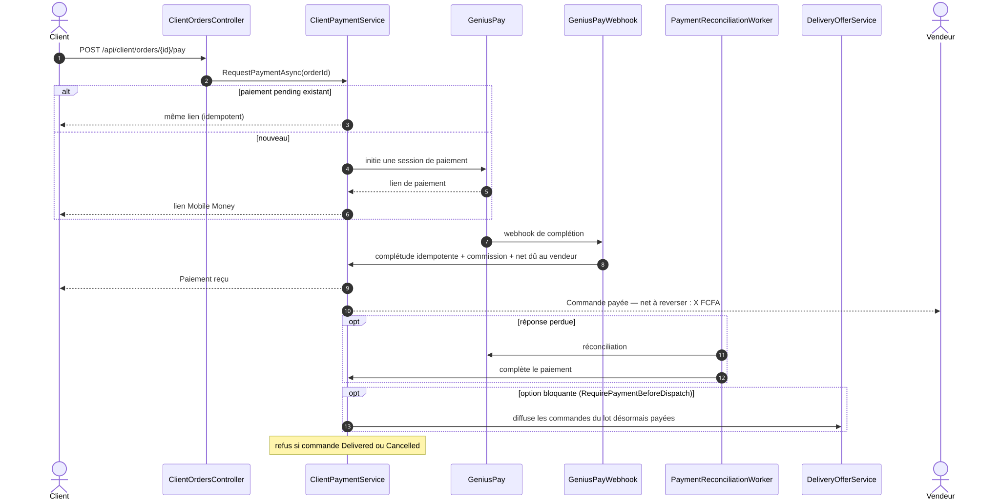

<details><summary>Source Mermaid</summary>

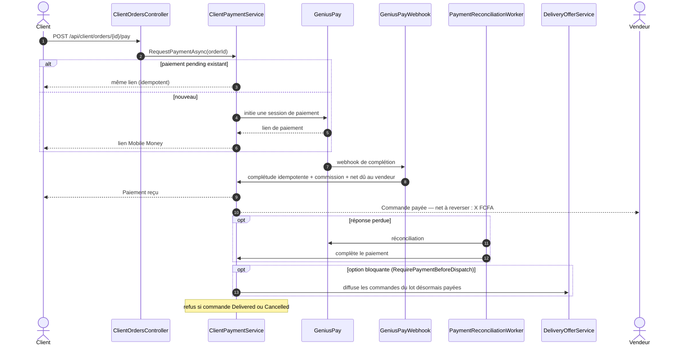
```mermaid
sequenceDiagram
    autonumber
    actor C as Client
    participant API as ClientOrdersController
    participant PS as ClientPaymentService
    participant G as GeniusPay
    participant GW as GeniusPayWebhook
    participant RC as PaymentReconciliationWorker
    participant D as DeliveryOfferService
    actor V as Vendeur

    C->>API: POST /api/client/orders/{id}/pay
    API->>PS: RequestPaymentAsync(orderId)
    alt paiement pending existant
        PS-->>C: même lien (idempotent)
    else nouveau
        PS->>G: initie une session de paiement
        G-->>PS: lien de paiement
        PS-->>C: lien Mobile Money
    end

    G->>GW: webhook de complétion
    GW->>PS: complétude idempotente + commission + net dû au vendeur
    PS-->>C: Paiement reçu
    PS-->>V: Commande payée — net à reverser : X FCFA

    opt réponse perdue
        RC->>G: réconciliation
        RC->>PS: complète le paiement
    end

    opt option bloquante (RequirePaymentBeforeDispatch)
        PS->>D: diffuse les commandes du lot désormais payées
    end

    note over PS: refus si commande Delivered ou Cancelled
```

</details>

## 11. Garantie Colis Sûr (sinistre)

Un vendeur déclare un colis perdu/volé ; le livreur est suspendu pendant l'enquête.

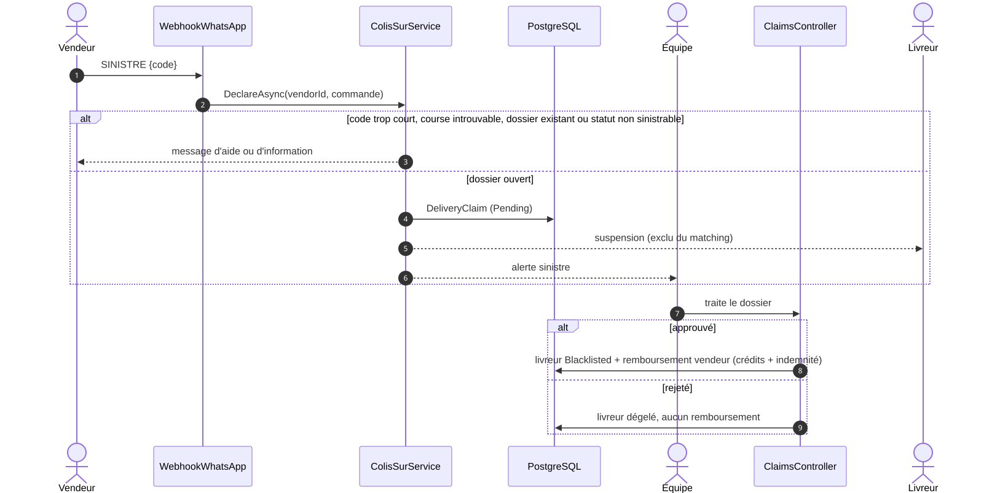

<details><summary>Source Mermaid</summary>

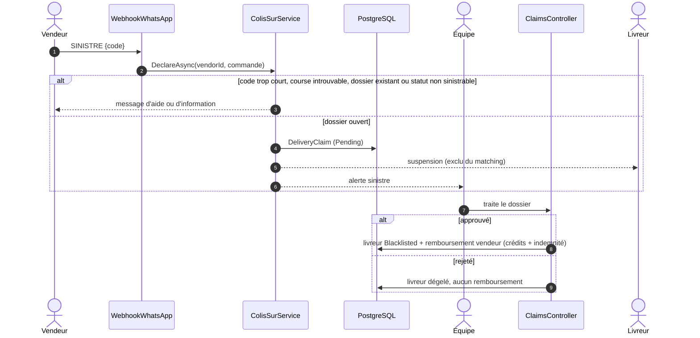
```mermaid
sequenceDiagram
    autonumber
    actor V as Vendeur
    participant W as WebhookWhatsApp
    participant CS as ColisSurService
    participant DB as PostgreSQL
    actor T as Équipe
    participant CL as ClaimsController
    actor L as Livreur

    V->>W: SINISTRE {code}
    W->>CS: DeclareAsync(vendorId, commande)
    alt code trop court, course introuvable, dossier existant ou statut non sinistrable
        CS-->>V: message d'aide ou d'information
    else dossier ouvert
        CS->>DB: DeliveryClaim (Pending)
        CS-->>L: suspension (exclu du matching)
        CS-->>T: alerte sinistre
    end

    T->>CL: traite le dossier
    alt approuvé
        CL->>DB: livreur Blacklisted + remboursement vendeur (crédits + indemnité)
    else rejeté
        CL->>DB: livreur dégelé, aucun remboursement
    end
```

</details>

## 12. Notation du livreur

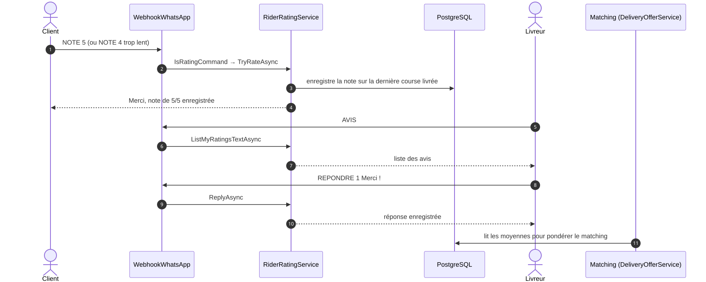

<details><summary>Source Mermaid</summary>

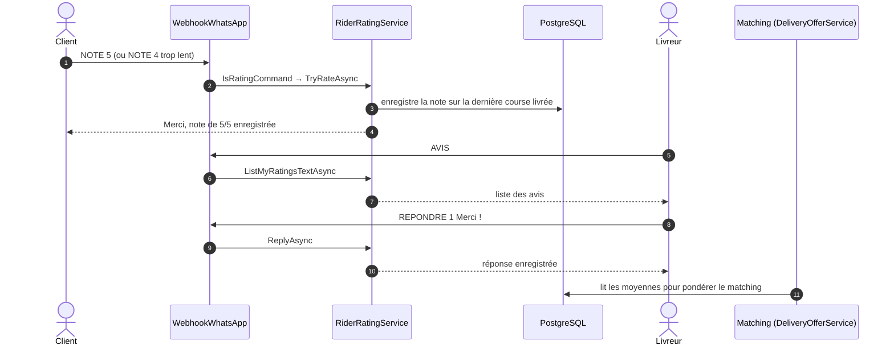
```mermaid
sequenceDiagram
    autonumber
    actor C as Client
    participant W as WebhookWhatsApp
    participant R as RiderRatingService
    participant DB as PostgreSQL
    actor L as Livreur
    participant M as Matching (DeliveryOfferService)

    C->>W: NOTE 5 (ou NOTE 4 trop lent)
    W->>R: IsRatingCommand → TryRateAsync
    R->>DB: enregistre la note sur la dernière course livrée
    R-->>C: Merci, note de 5/5 enregistrée

    L->>W: AVIS
    W->>R: ListMyRatingsTextAsync
    R-->>L: liste des avis
    L->>W: REPONDRE 1 Merci !
    W->>R: ReplyAsync
    R-->>L: réponse enregistrée

    M->>DB: lit les moyennes pour pondérer le matching
```

</details>

## 13. Recrutement livreur (acquisition)

Le recrutement est **100 % WhatsApp** : un numéro inconnu exprime son intention, le bot recueille
nom + quartier + photo CNI, puis crée le compte ; l'équipe certifie en 1 clic (`/app/certifications`).

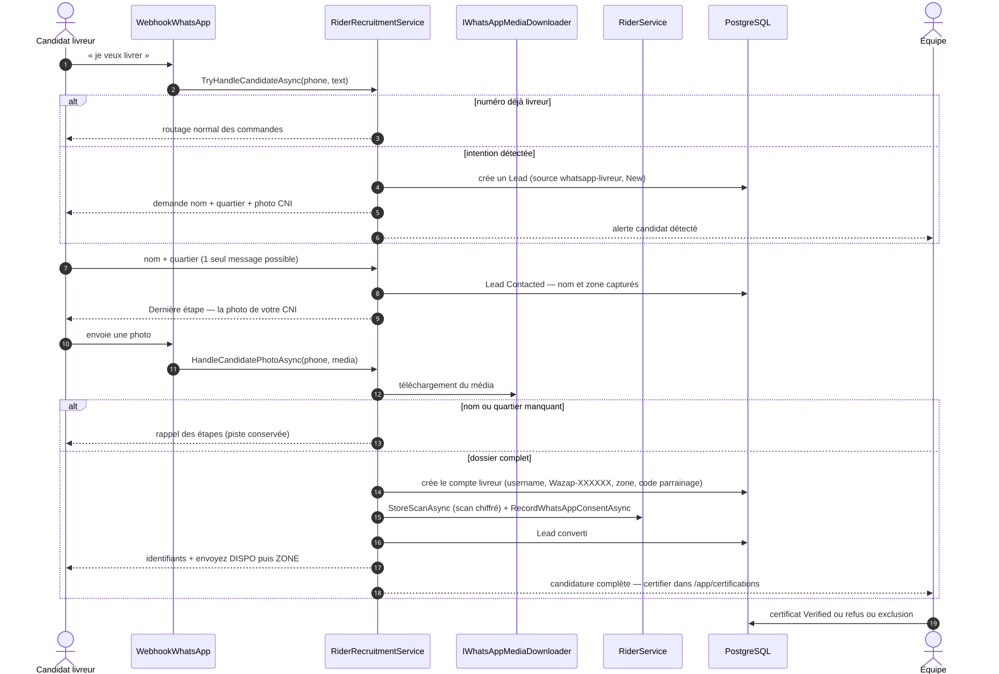

<details><summary>Source Mermaid</summary>

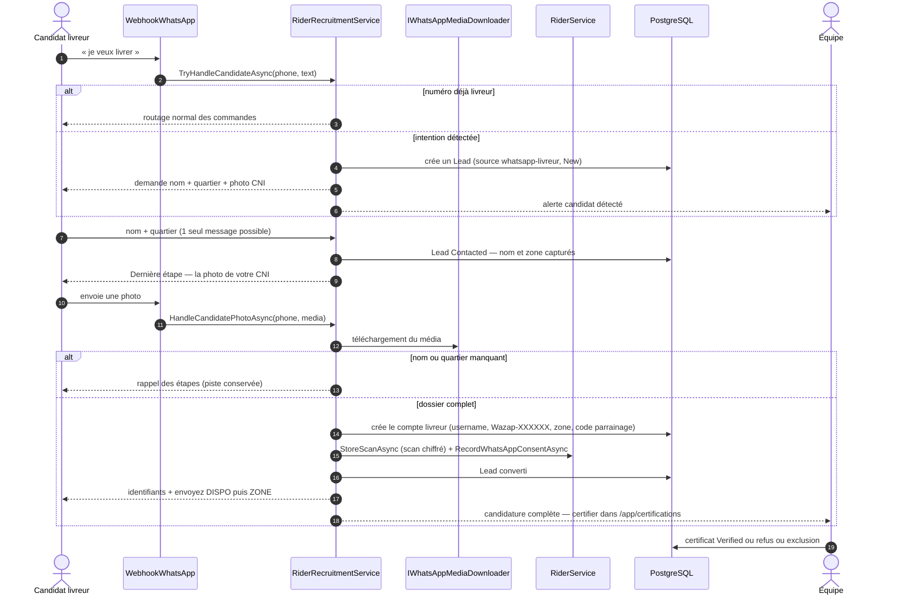
```mermaid
sequenceDiagram
    autonumber
    actor C as Candidat livreur
    participant W as WebhookWhatsApp
    participant R as RiderRecruitmentService
    participant M as IWhatsAppMediaDownloader
    participant RS as RiderService
    participant DB as PostgreSQL
    actor T as Équipe

    C->>W: « je veux livrer »
    W->>R: TryHandleCandidateAsync(phone, text)
    alt numéro déjà livreur
        R-->>C: routage normal des commandes
    else intention détectée
        R->>DB: crée un Lead (source whatsapp-livreur, New)
        R-->>C: demande nom + quartier + photo CNI
        R-->>T: alerte candidat détecté
    end

    C->>R: nom + quartier (1 seul message possible)
    R->>DB: Lead Contacted — nom et zone capturés
    R-->>C: Dernière étape — la photo de votre CNI

    C->>W: envoie une photo
    W->>R: HandleCandidatePhotoAsync(phone, media)
    R->>M: téléchargement du média
    alt nom ou quartier manquant
        R-->>C: rappel des étapes (piste conservée)
    else dossier complet
        R->>DB: crée le compte livreur (username, Wazap-XXXXXX, zone, code parrainage)
        R->>RS: StoreScanAsync (scan chiffré) + RecordWhatsAppConsentAsync
        R->>DB: Lead converti
        R-->>C: identifiants + envoyez DISPO puis ZONE
        R-->>T: candidature complète — certifier dans /app/certifications
    end

    T->>DB: certificat Verified ou refus ou exclusion
```

</details>

## 14. Options de configuration clés

| Option | Effet |
|---|---|
| `ClientOrderBot:Enabled` / `ExpirationHours` | bot de commande client (défaut ON, 24 h) |
| `Grouping:WindowMinutes` / `BuyerDispatchDelaySeconds` | fenêtre de groupage / délai avant diffusion acheteur |
| `Geo:ExclusivitySeconds` (30) / `GlobalTimeoutMinutes` (5) / `MaxDistanceKm` / `LocationFreshnessMinutes` | vagues, timeout global, rayon, fraîcheur GPS |
| `RiderSecurity:RequireCertifiedRiders` | n'offrir qu'aux livreurs certifiés (Colis Sûr) |
| `RiderReputation:MinimumAverageScore` / `MinimumRatingsBeforeFiltering` / `PreferHigherRatedRiders` | filtrage et pondération par réputation |
| `DeliveryProof:RequireClientCode` | exige le code client pour clôturer (livreur) |
| `ClientPayments:Enabled` / `RequirePaymentBeforeDispatch` | paiement Mobile Money, diffusion bloquée si impayé |
| `ColisSur:*` | seuils de la garantie Colis Sûr |

Constante domaine : `MaxDeliveryCodeAttempts = 5`.

---

## Références code

- **Domaine** : `src/Wazap.Domain/Entities/Order.cs`, `Enums/OrderStatus.cs`, `ClientOrderDraftStage.cs`, `DeliveryCodeResult.cs`, `DeliveryClaimStatus.cs`, `DeliveryOfferStatus.cs`, `DeliveryBatchStatus.cs`
- **Application** : `src/Wazap.Application/Services/OrderService.cs`, `DeliveryOfferService.cs`, `ClientPaymentService.cs`, `WhatsAppOrchestrationService.cs`
- **API** : `src/Wazap.API/Controllers/WebhookWhatsAppController.cs`, `ClientOrdersController.cs`, `OrdersController.cs`, `PublicApiV1Controller.cs`, `ClaimsController.cs`
- **Services** : `src/Wazap.API/Services/ClientOrderBotService.cs`, `ColisSurService.cs`, `RiderRatingService.cs`, `DeliveryOfferWorker.cs`
- **Web** : `web/src/pages/SuiviPage.tsx`
---

## Diagrammes exportés

Les images de cette page (`docs/diagrams/*.svg`, `*.png`) sont générées depuis les blocs Mermaid
ci-dessus par le script `scripts/render-mermaid.ps1` (rendu via le service [Kroki](https://kroki.io)).
Les sources `.mmd` sont conservées à côté des images.

```powershell
# Régénère les sources .mmd + images SVG et PNG dans docs/diagrams/
./scripts/render-mermaid.ps1

# Réintègre les images dans ce document (source Mermaid conservée dans un bloc repliable)
./scripts/render-mermaid.ps1 -Embed
```

