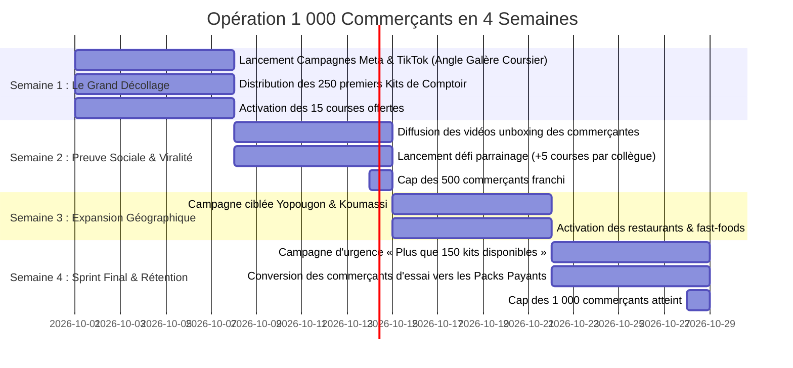

# Opération « 1 000 Commerçants en 4 Semaines » — WAZAP Côte d'Ivoire

## 1. Objectif & Vue d'Ensemble

* **Objectif** : Enrôler et activer **1 000 commerçants indépendants** à Abidjan en **28 jours** (4 semaines).
* **Rythme cible** : 250 commerçants activés par semaine (~35 commerçants par jour).
* **Zones prioritaires** :
  * **Phase 1 (Semaine 1-2)** : Cocody (Angré, Riviera, Deux-Plateaux, Vallon), Marcory (Zone 4, Résidentiel, VGE), Plateau.
  * **Phase 2 (Semaine 3-4)** : Yopougon (Maroc, Siporex, Bel Air), Treichville, Koumassi, Adjamé.
* **Typologie des commerçants cibles** :
  * Vendeuses de prêt-à-porter, friperie chic, lingeries, chaussures & sneakers.
  * Boutiques de cosmétiques, parfumeries, mèches & soins capillaires.
  * Restaurants, traiteurs, fast-foods locaux (garba chic, chawarma, braisés, jus naturels).
  * High-tech, accessoires téléphones & gadgets.

---

## 2. L'Offre Irrésistible d'Enrôlement (« The No-Brainer Offer »)

Pour convertir 1 000 commerçants sans résistance, l'offre doit éliminer **100% du risque perçu** :

### 🎁 « LE PACK BIENVENUE 1 000 PIONNIERS »
1. **15 LIVRAISONS 100% OFFERTES** : Zéro crédit débité pour démarrer, sans carte bancaire, sans engagement.
2. **LE KIT DE COMPTOIR PHYSIQUE OFFERT** :
   * Le **Chevalet de Comptoir Plexiglas WAZAP** personnalisé avec le QR Code Universel de la boutique (Wave, Orange, MTN, Moov).
   * Le **Rouleau de 100 Scellés de Sécurité Colis** « Garantie Colis Sûr WAZAP » inviolables.
   * Le **Sticker Vitrine** « Ici on livre en 30 min avec WAZAP ».
3. **LIVRAISON DU KIT EN 45 MINUTES** : Dès son inscription sur WhatsApp ou Facebook, un coursier WAZAP vient déposer son kit de bienvenue gratuitement dans sa boutique !
4. **0% DE COMMISSION SUR SES MARCHANDISES** : L'argent du commerçant est protégé et lui est reversé intégralement.

---

## 3. Répartition des Canaux d'Acquisition (Mix Marketing 360°)

| Canal | Part des Enrôlements | Volume Cible | Mécanisme Clé |
| :--- | :---: | :---: | :--- |
| **Meta Ads (Facebook & Instagram)** | 50% | **500 commerçants** | Formulaire instantané WhatsApp + Vidéo témoignage |
| **TikTok (Vidéos Virales & Spark Ads)** | 30% | **300 commerçants** | Humour nouchi « Les galères de coursier » $\rightarrow$ Lien bio |
| **Commando WhatsApp & Terrain** | 20% | **200 commerçants** | Prospection groupes marchands + Ambassadeurs marchés |
| **TOTAL** | **100%** | **1 000 commerçants** | **En 28 jours** |

---

## 4. Rétroplanning de Déploiement Semaine par Semaine

### 🗓️ Détail Semaine par Semaine :

* **Semaine 1 (J1 à J7) : Le Grand Décollage (Objectif : 250 commerçants)**
  * Lancement des campagnes sponsorisées Facebook/Instagram orientées "Douleur" (coursier injoignable, client qui annule).
  * Mobilisation de la brigade de coursiers WAZAP pour livrer les 250 premiers kits de bienvenue avec photo souvenir en boutique.
  * Message d'activation immédiate sur WhatsApp : *"Votre compte est crédité de 15 courses gratuites, testez dès aujourd'hui !"*

* **Semaine 2 (J8 à J14) : Preuve Sociale & Effet Boule de Neige (Objectif : 250 commerçants $\rightarrow$ Total 500)**
  * Publication des vidéos TikTok montrant de vraies vendeuses avec leur chevalet WAZAP sur leur comptoir.
  * Déploiement de la boucle virale : *"Parraine une commerçante voisine avec ton code $\rightarrow$ Gagne +5 livraisons gratuites !"*
  * Relance des inscrits S1 qui n'ont pas encore utilisé leur premier crédit.

* **Semaine 3 (J15 à J21) : Conquête des Pôles Commerciaux Clés (Objectif : 250 commerçants $\rightarrow$ Total 750)**
  * Déploiement terrain à Yopougon Maroc, Cocody Angré et Treichville.
  * Webinaire / Live Facebook de 15 minutes : *"Comment doubler ses ventes en ligne sans stress de livraison à Abidjan"*.
  * Focus sur les créneaux chauds (commandes du midi pour la nourriture, vendredis/samedis pour les vêtements).

* **Semaine 4 (J22 à J28) : Le Sprint Final & Passage au Payant (Objectif : 250 commerçants $\rightarrow$ Total 1 000)**
  * Campagne sentiment d'urgence : *"Derniers jours pour obtenir le Pack 15 courses gratuites + Chevalet offert"*.
  * Présentation des Packs Commerçant rentables (notamment le **Pack Moyen à 10 000 F pour 80 livraisons = 125 F/course**).
  * Célébration publique du **1 000ème Commerçant Certifié WAZAP** sur les réseaux sociaux.
