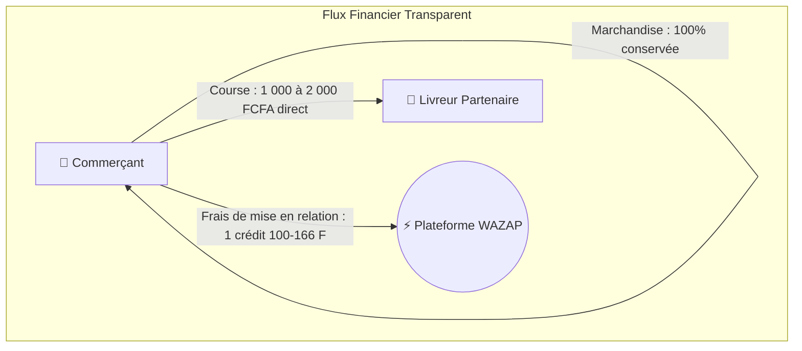

# 🛵⚡ STRATÉGIE DE CONQUÊTE LIVREURS & GRILLE TARIFAIRE PLANCHER
## Exploitation de la Crise des Tarifs Yango & Modèle de Mise en Relation Équitable WAZAP

> **Date de formalisation :** 28/09/2026  
> **Axe stratégique :** Conquête agressive et fidélisation de la flotte motards du Grand Abidjan  
> **Principe cardinal :** **Zéro commission sur le livreur + Plancher garanti de 1 000 FCFA net dès le 1er mètre**  
> **Modèle d'affaires WAZAP :** Pure mise en relation technologique financée par le commerçant (100 à 166 FCFA/crédit)

---

## 1. 🔍 Diagnostic du Marché : La Faille Critique de Yango Livraison

### A. La grogne grandissante des livreurs sur les réseaux sociaux
Sur les principaux groupes Facebook et boucles WhatsApp de coursiers d'Abidjan (*« Les Livreurs d'Abidjan »*, *« Motards et Livreurs de Côte d'Ivoire »*, *« Coursiers Professionnels 225 »*), un mécontentement massif explose quotidiennement contre la plateforme Yango Livraison.

Les griefs récurrents des motards :
1. **Tarifs dérisoires au kilomètre :** Le barème officiel Yango (320 FCFA de base + 50 FCFA/km) produit des courses de 2 à 3 km rémunérées **entre 420 et 500 FCFA bruts**.
2. **Pertes sèches face aux réalités du terrain :**
   - Le litre de super est à 875 FCFA.
   - Les embouteillages d'Abidjan (Pont HKB, Boulevard Latrille, Carrefour Indénié, Autoroute du Nord) triplent le temps de trajet réel sans compensation tarifaire adéquate.
   - L'usure de la moto (pneus, vidange, amortisseurs) et le risque corporel permanent ne sont pas couverts.
3. **Commissions et intermédiaires prédateurs :** Les flottes partenaires et la plateforme ponctionnent jusqu'à 15-20% du montant brut, réduisant le gain net à peau de chagrin.
4. **Portefeuilles virtuels et argent bloqué :** Les livreurs attendent des jours pour débloquer leurs gains ou subissent des retenues algorithmiques opaques.

### B. Conséquences pour les commerçants et les clients
* **Taux d'annulation record :** Les motards refusent en masse les courses courtes ou mal payées.
* **Délais d'attente insupportables :** Les commerçants voient leurs commandes prêtes stagner 45 minutes avant de trouver un coursier.
* **Dégradation de l'expérience client :** Livreur frustré = accueil froid, nourriture secouée ou refroidie, clients perdus pour la boutique.

---

## 2. 🛡️ Le Contre-Modèle WAZAP : Dignité & Plancher Inviolable

WAZAP se positionne comme **le défenseur du motard indépendant et le garant de la qualité pour le commerçant**.

### La Règle Inviolable du Plancher 1 000 FCFA
* **Aucune course sur WAZAP ne peut être proposée à moins de 1 000 FCFA nets.**
* Même pour un trajet de 300 mètres dans le même quartier, le coursier perçoit ses **1 000 FCFA pleins**.
* **Zéro commission plateforme sur le coursier (0 FCFA) :** 100% du montant de la livraison va directement dans la poche du livreur, en cash direct à la livraison ou par Mobile Money (Wave / Orange Money).

```
   COMPARAISON DIRECTE POUR UN LIVREUR (5 courses courtes / jour) :
   ────────────────────────────────────────────────────────────────
   🟡 Sur Yango :  5 × 450 F = 2 250 F brut - comm. flottes (~350 F) - essence (1 000 F) = ~900 F net !
   🟢 Sur WAZAP :  5 × 1 000 F = 5 000 F net direct - essence (1 000 F) = 4 000 F net (×4,4 plus rentable !)
```

---

## 3. 🗺️ Grille Tarifaire Officielle Abidjan (Paliers Clairs & Équitables)

Pour simplifier la vie des commerçants et garantir un revenu juste aux livreurs, WAZAP établit une grille de recommandation transparente basée sur la topographie abidjanaise :

| Palier | Zone de Trajet | Distance Typique | Tarif Recommandé (100% Livreur) | Exemples Concrets |
|:---|:---|:---:|:---:|:---|
| **Palier 1 : Plancher Garanti** | **Intra-Commune** | 0 à 4 km | **1 000 FCFA** | Cocody Angré ➔ Riviera 2, Yopougon Siporex ➔ Maroc, Marcory Zone 4 ➔ Biétry |
| **Palier 2 : Liaison Voisine** | **Communes Limitrophes (Même rive)** | 4 à 8 km | **1 500 FCFA** | Cocody ➔ Plateau, Marcory ➔ Koumassi, Treichville ➔ Plateau, Adjamé ➔ Attécoubé |
| **Palier 3 : Traversée Express** | **Inter-Rives / Longue Distance** | 8 à 15 km | **2 000 FCFA** | Yopougon ➔ Cocody, Abobo ➔ Marcory, Plateau ➔ Port-Bouët, Cocody ➔ Koumassi |
| **Palier 4 : Périphérie** | **Grand Abidjan / Extérieur** | > 15 km | **2 500 à 3 000 FCFA** | Abidjan ➔ Bingerville, Grand-Bassam, Songon |

### Règle technique stricte du système
* **Garde-fou applicatif (Backend & Frontend) :** Toute tentative de saisie d'un `DeliveryFee < 1000` est bloquée avec le message d'intégrité :
  > *« Le tarif de livraison ne peut pas être inférieur au plancher garanti de 1 000 FCFA pour le livreur partenaire WAZAP. »*

---

## 4. 💼 Le Business Model Découplé de WAZAP

WAZAP refuse le modèle prédateur des plateformes classiques (qui prennent à la fois 25% au commerçant et 20% au livreur).



### 1. Source de Revenus Principale : Les Packs de Crédits Commerçants
* Le commerçant achète des packs de crédits prépayés (Wave, Orange Money, MTN) :
  * Pack Découverte : 15 courses offertes (0 FCFA commission WAZAP)
  * Pack Essai : 30 crédits = 5 000 FCFA (166,7 FCFA / course)
  * Pack Standard : 100 crédits = 14 000 FCFA (140 FCFA / course)
  * Pack Pro : 300 crédits = 37 500 FCFA (125 FCFA / course)
  * Pack VIP : 1 000 crédits = 100 000 FCFA (100 FCFA / course)
* **Débit à l'acceptation :** 1 crédit est débité du compte commerçant uniquement lorsqu'un livreur accepte formellement la course.

### 2. Pourquoi le Commerçant Accepte le Plancher de 1 000 F + 1 Crédit
1. **Économie colossale face à Glovo / Yango Food :**
   * Sur un plat à 5 000 FCFA, Glovo prélève ~1 500 FCFA de commission (30%).
   * Sur WAZAP, le commerçant conserve ses 5 000 FCFA intègres et ne paie que **125 FCFA** de mise en relation. Il gagne **1 375 FCFA de marge nette en plus** sur chaque vente !
2. **Disponibilité foudroyante :** Parce que les motards savent qu'ils touchent au minimum 1 000 FCFA nets en direct, ils acceptent les courses WAZAP en moins de **60 secondes**.
3. **Sécurité & Image :** Suivi live GPS rassurant pour le client final + **Assurance Colis Sûr** jusqu'à 50 000 FCFA.

### 3. Source de Revenus Complémentaire : Le Pass Prioritaire Motard (Micro-SaaS)
* Pour les motards très actifs souhaitant maximiser leurs tournées journalières :
  * Accès anticipé aux alertes de courses (15 à 30 secondes avant la diffusion générale sur la commune).
  * Monétisation micro-abonnement : 1 000 FCFA / semaine ou 3 000 FCFA / mois (déjà architecturé dans `RiderPriorityService.cs`).

---

## 5. 🎯 Plan d'Action & Conquête : « Opération Dignité Motard »

### Action 1 : Infiltration & Guerilla Marketing sur les Groupes Facebook
* **Cible :** Groupes Facebook de livreurs d'Abidjan (plus de 120 000 membres cumulés).
* **Message d'accroche (Hook anti-Yango) :**
  > 🛑 *« LIVREUR D'ABIDJAN : Pourquoi tu acceptes des courses à 450 FCFA sous le soleil et la pluie ?  
  > Sur WAZAP, la règle est gravée dans le marbre : **JAMAIS EN DESSOUS DE 1 000 FCFA LA COURSE !**  
  > ✅ 1 000 FCFA net minimum garanti dès le 1er mètre.  
  > ✅ 0% de commission prélevée sur toi (100% de la course dans ta poche).  
  > ✅ Paiement cash immédiat ou Wave direct.  
  > ✅ Zéro patron, zéro application lourde : tout se passe sur WhatsApp en 1 clic.  
  > 👉 Rejoins les motards qui respectent leur moto : wa.me/2250787119520?text=DISPO »*

### Action 2 : Parcours d'Onboarding Zéro Friction (WhatsApp + OCR CNI)
* Le motard ne télécharge aucune application Play Store qui surcharge son téléphone.
* Il scanne le QR code ou envoie un message WhatsApp au `+225 07 87 11 95 20`.
* Il répond par un chiffre (1 à 6) pour sa commune.
* Il envoie la photo de sa CNI (analysée en 3 secondes par Google Cloud Vision OCR).
* Il clique sur le bouton interactif **`🟢 DISPO`** et commence à recevoir les courses à 1 000 F minimum.

### Action 3 : Le Grand Défi Motard « Smartphone Redmi 15C Neuf »
* Un smartphone Android neuf remis au livreur le plus actif du mois dans chaque grande commune (Cocody, Yopougon, Marcory).
* Effet de viralité immédiat et bouche-à-oreille entre coursiers aux stations-services et carrefours stratégiques.

### Action 4 : Pitch Commerçant « Vitesse & Qualité Garantie »
* Message adressé aux commerçants lors des relances et onboarding :
  > *« Pourquoi vos colis mettaient 1h à partir ? Parce qu'un livreur payé 400 F traîne des pieds. Chez WAZAP, nos livreurs certifiés gagnent 1 000 F nets minimum. Ils arrivent en 3 minutes, souriants, avec le sac propre et le respect de votre client. »*

---

## 6. 🛠️ Feuille de Route d'Implémentation Technique

1. **Service Métier de Grille Tarifaire (`AbidjanDeliveryPricing.cs`) :**
   * Définition formelle des zones et calcul automatique de la recommandation tarifaire (1 000 F, 1 500 F, 2 000 F, 2 500 F) selon la commune de départ et d'arrivée.
2. **Garde-fous Plancher Inviolable (Backend .NET 10) :**
   * `Order.cs` : `MinimumDeliveryFee = 1000m;`. Validation stricte dans le constructeur et `SetDeliveryFee(decimal)`.
   * `CreateOrderRequest.cs` & `OrderService.cs` : Rejet ou ajustement automatique au plancher de 1 000 FCFA.
   * `VendorCommandParser.cs` : Recommandation automatique basée sur la commune détectée, plancher à 1 000 FCFA.
3. **Frontend Dashboard Vendeur (`VendorDashboardPage.tsx`) :**
   * Validation `deliveryFee >= 1000`.
   * Sélecteur visuel avec libellés explicites : `1 000 F (Intra-commune / Plancher)`, `1 500 F (Voisine)`, `2 000 F (Traversée)`.
4. **Validation par les Tests Unitaires & E2E :**
   * Tests unitaires couvrant le rejet systématique de tout tarif inférieur à 1 000 FCFA et le calcul de la grille tarifaire.
